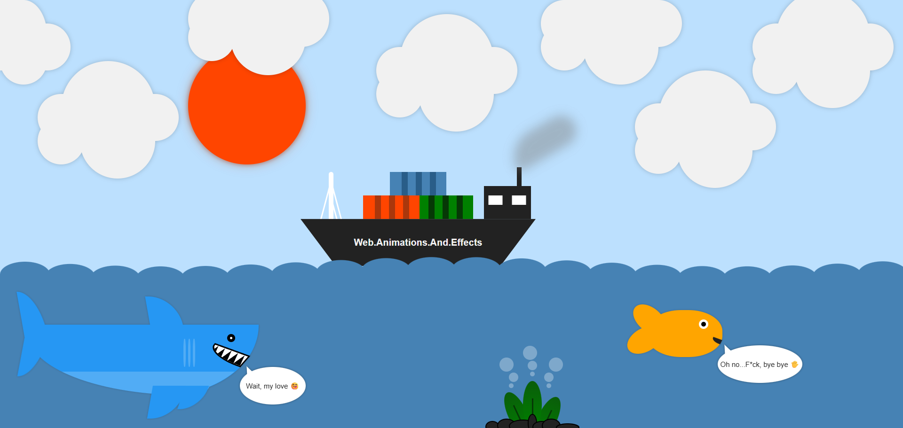

# CSS Art Image

-   This project is part of my personal CSS Art gallery. It’s designed as a static visual piece (like an image), not optimized for responsiveness or mobile – desktop only. Created with React + Vite.

# Screenshot

# Build with

-   React + Vite
-   SCSS - BEM
-   Desktop-first workflow

# Author

-   Frontend Mentor - [Jojo25011990](https://www.frontendmentor.io/profile/Jojo25011990)
-   Instagram - [web.animations.and.effects](https://www.instagram.com/web.animations.and.effects)
-   Tiktok - [web.anim.and.effects](https://www.tiktok.com/@web.anim.and.effects)
-   Youtube - [web.animations.and.effects](https://www.youtube.com/@web.animations.and.effects)
-   Linkedin - [Jozef Kudrna](https://www.linkedin.com/in/jozef-kudrna-28b580295)
